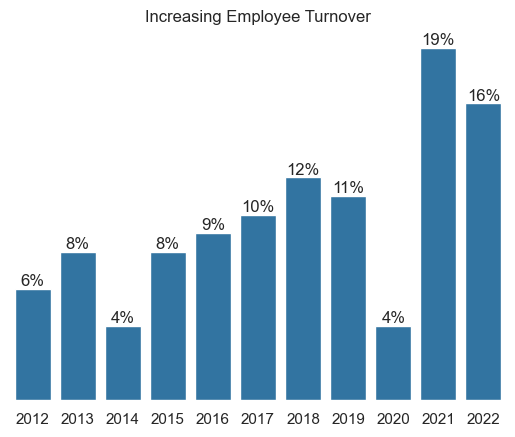
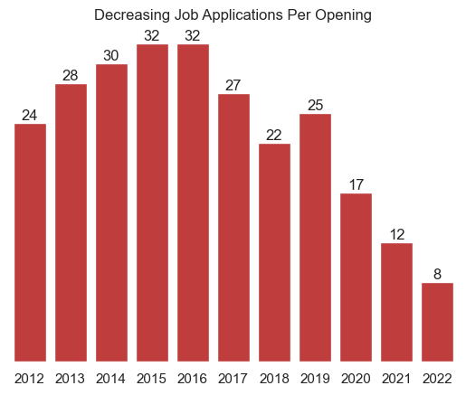
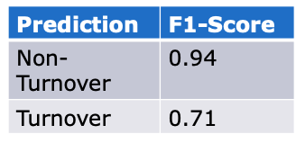
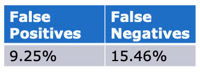
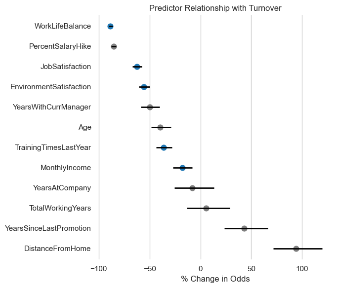

# Analyzing Employee Turnover at Acme Aroma

*Acme Aroma is a fictional perfume company in India. The objective of this project is to act as data scientist analyzing employee data and communicating insights to the executive staff. Data for this project was generated for the University of Michigan Applied Data Science - Data Science Communication Course.*

## Overview

Increasing employee turnover has placed a strain on Acme operations. Turnover has increased significantly over the last several years, increasing from a previous high of 12% in 2018 to 19% and 16% in 2021 and 2022, respectively. In addition, employee surveys show a decrease in satisfaction from 3.4 to 2.7 during this same period.

**The objective is to determine which employees are at high-risk for turnover, and what should be done to reduce it.**

## Key Insights

Employee survey data analysis yielded a model that accurately predicts non- turnover scenarios and offers reasonable predictions for turnover occurrences.
- **36% of employees** in the dataset identified as leaving the company **rated work-life balance as ”Bad” ( 1 on a 1-4 scale).**
- **An increase in Work-Life Balance** by one standard deviation in survey scores **is linked to an 86.5% to 90.3% reduction in the odds of turnover**.
- This initiative is anticipated to yield a **3% reduction in turnove**r** and **potentially save approximately ₹126,225,521** in acquisition expenses, based on a sample of the provided data.

## Problem: Increase in employee turnover
Acme Aroma has witnessed an increase in employee turnover over the past few years, with turnover rates rising from 12% in 2018 to 19% and 16% in 2021 and 2022, respectively. This is accompanied by several issues:
- **Declining employee satisfaction** - Down from a score of 3.4 to 2.7.
- **Declining number of job applications per opening** - Down from 32 applicants in 2016 to just 8 applicants in 2022.
- **Increasing cost of employee acquisition** - Doubled from ₹15,000 to ₹30,000 between 2021 and 2022.

  

    
    
  

## Approach: Employee turnover model

Our approach centered on creating an employee turnover model to gauge the risk of employees leaving the company using key predictors for turnover risk in survey data acquired from Acme Aroma's human resources information system.

### Model Description:

The model includes the key variables associated with each initiative: **monthly income, how often training is provided, how satisfied employees are with their work environment and job, and work-life balance**. Additionally, the model includes other variables with notable correlation with turnover such as: the percentage their salary has increased, how long they've worked in total and at the current company, their age, the time they've spent with their current manager, and the time since their last promotion.

### F1 Score:
The model achieved an F1 score of 0.94 for the negative class (non- turnover) and 0.71 for the positive class (employee turnover). This indicates that the model is highly effective at identifying non-turnover cases, and moderately effective at identifying actual turnover cases.

  

    
  

### False Positive/Negative Rate:

The false positive rate, which represents cases wrongly predicted as turnover when they are not, was 9.25%. This means that about 9.25% of the predictions for turnover were incorrect, indicating a relatively low rate of false alarms.

The false negative rate, which represents cases wrongly predicted as non-turnover when they is turnover, was 15.46%. This indicates that about 15.46% of actual turnover cases were not identified by the model.

Overall, the model demonstrates strong performance in accurately predicting non-turnover cases, while also providing reasonable predictions for turnover cases. While there is room for improvement in reducing false negatives, the model's ability to keep false positives low suggests it can be a valuable tool for making informed decisions about employee retention strategies.

  

    
  

### Analyzing Turnover Associated Factors

The relationship between various factors and employee turnover as determined by the model is expressed here in percent change in odds. The relationships here mirror the correlation-based analysis. Two key predictors stand out: Work-Life Balance and Percent Salary Hike

#### Work-Life Balance:
Work-Life Balance has a significant impact on turnover. A standard deviation increase in Work-Life Balance is associated with a decrease in the odds of turnover by approximately 86.5% to 90.3%
This suggests that when employees perceive a better work-life balance, they are significantly less likely to leave the company.

#### Percent Salary Hike:
Percent Salary Hike also plays a crucial role in turnover. A one standard deviation increase in Percent Salary Hike is linked to a decrease in the odds of turnover by approximately 82.8% to 87.8%
This suggest that employees who receive higher salary hikes are less likely to leave. It may be beneficial to consider compensation strategies, as this is not a current initiative option.

#### Other Factors:

Other initiative factors are not as strongly related. Job satisfaction, environment satisfaction, amount of training and monthly income all fall below a 65% change in odds with more uncertainty in estimation.

  

    
  

## Primary Recommendation: Work-Life Balance Initiatives

To mitigate the escalating turnover rate and associated costs, Acme Aroma should aim to **enhance Work-Life Balance by forcusing on intiatives such as reducing mandatory business travel.**

Limiting required business travel to improve work life balance is a reasonable initiative given the strong negative correlation of work life balance with employee turnover.
This option is projected to result in a 3% reduction in turnover and savings of approximately ₹126,225,521, based on the model and sample data.

## Limitations
While the model demonstrates an F1 score of 0.71 for turnover cases, and a false positive rate of 9.25% indicating reasonable predictive performance, improvements can be made.

The primary challenge lies in the false negative rate of 15.46%, which signifies the risk of losing valuable employees due to inaccuracies in predictions. The skewed data distribution towards employees staying at Acme Aroma poses challenges In identifying attributes of departing employees.

To address these challenges, **explore opportunities for gathering additional data**, including sentiment analysis through open- ended survey responses, and **continuously refine the predictive model**.

Finally, to effectively address the growing turnover trend, Acme Aroma should **aim to understand other turnover factors and adopt a multi-faceted approach that encompasses improved work-life balance**.